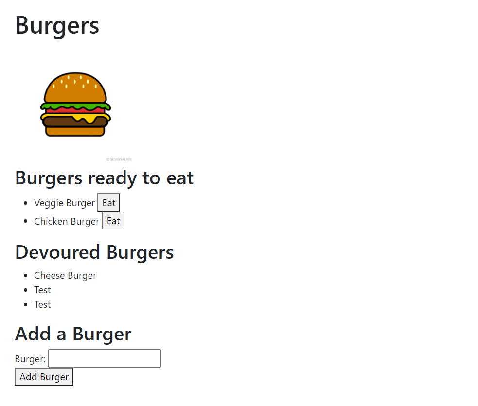

# Burger-Application

## Description  
The application communicates with MySQL to track the burgers that the user has created and devoured. The user can create using the input box, and devour using the eat button beside each burger. Upon eating, the burger will be transfered to the devour column where it can no longer be used. 

## Screenshot

## Link
https://burger-application-bootcamp.herokuapp.com/